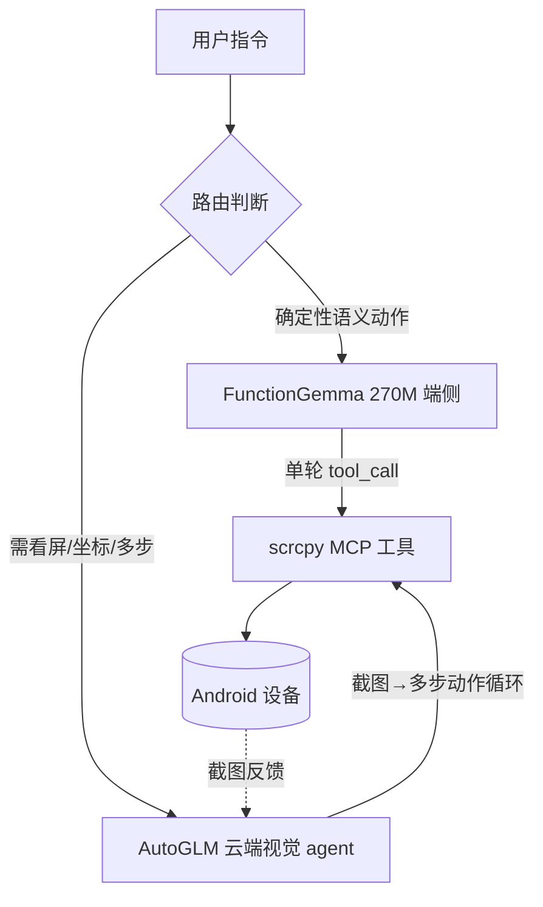

# 端侧 FunctionGemma + 云端 AutoGLM 混合路由

把一句用户指令分到两条执行路径：能纯文本确定映射的「语义动作」走端侧 270M 小模型（快、离线、省云），需要看屏幕/坐标/多步的「视觉任务」走云端 AutoGLM。

## 架构

- **FunctionGemma**：纯文本，看不到屏幕，单轮输出一次 `tool_call`。适合参数可从指令文本直接确定的工具。
- **AutoGLM**：多模态，看截图，自带多步规划与纠错。坐标型动作只能它干。
- 两者最终都落到同一套 scrcpy MCP 工具上，不冲突。

## 工具分流规则

| 工具 | 参数 | 走端侧 (FunctionGemma) | 原因 |
|---|---|---|---|
| `set_torch` | on | ✅ | 开关语义确定 |
| `set_screen_power` | on | ✅ | 同上 |
| `rotate_device` | — | ✅ | 无参 |
| `press_back` | — | ✅ | 无参 |
| `collapse_panels` | — | ✅ | 无参 |
| `expand_notification_panel` | — | ✅ | 无参 |
| `expand_settings_panel` | — | ✅ | 无参 |
| `camera_zoom` | direction | ✅ | 枚举 in/out |
| `inject_text` | text | ✅ | 文本直接取自指令 |
| `set_clipboard` / `get_clipboard` | text | ✅ | 文本/无参 |
| `start_app` | package | ⚠️ | 需「app名→包名」映射表，建好就 ✅ |
| `inject_key` | keycode | ⚠️ | 仅限已知键（HOME/音量等）枚举映射 |
| `inject_touch` | x,y,w,h | ❌ | 需像素坐标，必须看屏 |
| `inject_swipe` | 坐标 | ❌ | 同上 |
| `inject_scroll` | 坐标 | ❌ | 同上 |
| `run_task` | device_id, message | ❌ | 本身就是 AutoGLM agent 入口 |
| `start/stop_mirroring`、`*_recording`、`take_screenshot`、`list_devices` | — | 🔧 | 基础设施/宿主操作，不归模型决策 |

图例：✅ 端侧直接出 tool_call ｜ ⚠️ 需先建映射表 ｜ ❌ 必须走云端视觉 ｜ 🔧 宿主侧基础设施

## 路由策略（建议）

1. **先端侧**：指令进来先给 FunctionGemma。若它高置信地命中上表 ✅/⚠️ 工具 → 直接执行，不上云。
2. **兜底上云**：FunctionGemma 无匹配、置信度低、或命中 ❌ 类意图（"在某app里找到X并下单"）→ 交给 AutoGLM 看截图自主完成。
3. **`⚠️` 两类的前提**：
   - `start_app`：维护一张「常用 app 名 → 包名」表（中文名/别名 → `com.xxx`）。
   - `inject_key`：只暴露白名单键（HOME / BACK / 音量 / 电源…）的枚举，别让小模型猜任意 keycode。

## 取舍说明

- 端侧只接「确定性语义指令」，是为了让 270M 模型在它能力范围内稳定，不强求它做视觉/规划。
- 坐标与多步任务的复杂度本质上需要视觉与闭环反馈，留给 AutoGLM 是正确的边界，而非临时妥协。
- FunctionGemma 数据（289MB / 0.24s 首 token）来自官方 model card 实测；AutoGLM 具体参数智谱未完全公开，此处按相对量级处理。
